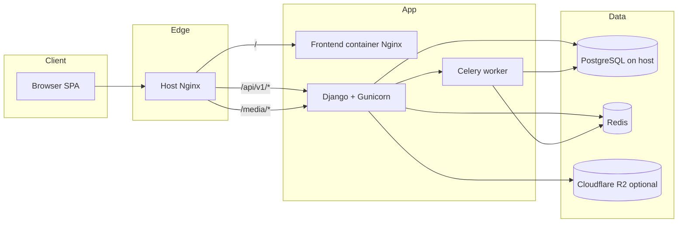

# Ummah Tech Fest — Project Documentation

**Document purpose:** Structured summary for Notion, stakeholders, and onboarding.  
**Last updated:** June 2026  
**Repository:** `Ummahtechfest` monorepo (marketing site, registration, volunteer portal, admin CMS, Django API)

---

## 1. Project Overview

### What the app does

**Ummah Tech Fest** is a full-stack web platform for **Ummah Tech Fest Ghana 2026** — a large technology and innovation summit in Accra. The product combines:

- A **public marketing website** (homepage, sponsor page, apply-to-speak, accommodation/visa info, coming-soon gates for schedule/tickets)
- **Event registration** via multiple pass types (delegate, startup, student, policy, investor, academic, media, volunteer)
- A **volunteer program** with role pathways and application review
- **Outreach forms** (sponsor inquiries, speaker applications, ticket waitlist)
- A **React-based admin portal** (`/admin/*`) for CMS content, submissions review, pass configuration, schedule, and staff RBAC

All user-facing flows talk to a versioned REST API (`/api/v1/`) backed by PostgreSQL, Redis caching, and optional Cloudflare R2 for uploaded media.

### Who it is for

| Audience | How they use the platform |
|----------|---------------------------|
| **Attendees & applicants** | Browse the fest, choose a pass, create an account (email OTP), complete registration or special-access application, check registration status |
| **Volunteers** | Apply for volunteer roles, track application status |
| **Speakers & sponsors (prospects)** | Submit speaker applications (with photo/CV) or sponsor inquiries |
| **Operations / content staff** | Manage homepage CMS, speakers, homepage sponsor logos, sponsorship tiers, schedule, and review submissions |
| **Super admins** | Full portal access, staff invites, user/role management |

### Core problem it solves

The fest needs a **single, branded digital hub** that:

1. **Captures demand** before and during ticket sales (waitlist, pass interest, gated “coming soon” pages)
2. **Runs structured registration** with different rules per pass (open checkout vs approval-only vs volunteer-only)
3. **Centralizes operational workflows** (review speaker/sponsor/volunteer submissions in one admin UI instead of spreadsheets)
4. **Lets non-developers update** hero copy, stats, sponsor logos, schedule, and sponsorship packages without redeploying the frontend

Without this system, registration, content updates, and reviewer workflows would be fragmented across forms, email, and manual databases.

---

## 2. Tech Stack

### Frontend

| Technology | Role |
|------------|------|
| **React 19** | UI library |
| **Vite 8** | Dev server, build tooling |
| **React Router 7** | Client-side routing (SPA) |
| **Tailwind CSS 4** | Styling (custom design tokens: primary, surface, etc.) |
| **AOS** | Scroll animations on marketing pages |
| **Vitest + React Testing Library** | Component tests (e.g. header, auth UX) |

- **Build output:** Static SPA served by Nginx in production (`frontend/Dockerfile.prod`)
- **API base URL:** `VITE_API_BASE_URL=/api/v1` (proxied in dev via Vite or Docker nginx)

### Backend

| Technology | Role |
|------------|------|
| **Python 3** | Runtime |
| **Django 5.1** | Web framework |
| **Django REST Framework 3.x** | REST API |
| **djangorestframework-simplejwt** | JWT access + refresh tokens (blacklist on rotation) |
| **Gunicorn** | Production WSGI server |
| **Celery 5** | Async tasks (e.g. Telegram monitoring emails) |
| **drf-spectacular** | OpenAPI schema + Swagger at `/api/v1/docs/` |
| **django-environ** | Environment configuration |
| **django-cors-headers** | CORS for SPA origins |
| **django-filter** | Query filtering on list endpoints |
| **django-redis** | Cache backend |
| **django-storages + boto3** | S3-compatible storage (Cloudflare R2) |
| **Whitenoise** | Static file serving for Django admin/static |
| **psycopg 3** | PostgreSQL driver |

### Database & cache

| Component | Details |
|-----------|---------|
| **PostgreSQL** | Primary datastore (runs on **host machine** in Docker setups, not containerized) |
| **Redis 7** | Cache (CMS public lists), Celery broker/result backend |

### Hosting & infrastructure

| Layer | Production setup |
|-------|------------------|
| **VPS** | Single-server deployment pattern documented in `nginx/HOST_SETUP.md` |
| **Host Nginx** | TLS termination, routes `/api/`, `/admin/`, `/static/`, `/media/` → Django (`127.0.0.1:8000`); `/` → frontend container (`127.0.0.1:8081`) |
| **Docker Compose** | `docker-compose.prod.yml`: `backend`, `frontend`, `redis`, `celery` (localhost-bound ports) |
| **Dev Compose** | `docker-compose.yml`: adds dev `nginx` gateway on port 8080 |
| **Media storage** | Local Docker volume `utf_media` **or** **Cloudflare R2** when `R2_*` env vars are set |
| **Email** | SMTP (production); console backend in dev |
| **Monitoring (optional)** | Telegram bot notifications for key events via Celery |

### Key external services

- **Cloudflare R2** — CMS/uploads (hero video, speaker photos, sponsor logos, speaker application assets)
- **SMTP provider** — OTP, password reset, staff invites
- **Telegram Bot API** — Optional ops notifications (`TELEGRAM_*` env vars)

### Repository layout

```
backend/          Django apps: accounts, registrations, volunteers, cms, outreach
frontend/         React SPA (public pages + /admin portal)
nginx/            Host and local reverse-proxy configs
docs/             Development tasks + this document
docker-compose.yml / docker-compose.prod.yml
```

> **Note:** This monorepo does **not** include a separate feeds/microservice stack; all features described here live in the backend + frontend above.

---

## 3. System Architecture

### High-level request flow



### Component responsibilities

1. **Browser (React SPA)**  
   - Renders marketing and registration UI  
   - Stores JWT in client (AuthContext); attaches `Authorization: Bearer` to protected API calls  
   - Admin routes under `/admin/*` gated by `admin_permissions` from `GET /api/v1/auth/me/`

2. **Host Nginx**  
   - Single public entry point in production  
   - SPA fallback: React admin routes (e.g. `/admin/sponsors`) must return `index.html` — configured in `nginx/host-production.live.conf` and `frontend/nginx-spa.conf`

3. **Django API**  
   - Business logic, validation, permissions, throttling  
   - Consistent JSON: success `{ data, meta? }`, errors `{ error: { code, message, details? } }`  
   - Public media served via `PublicMediaView` at `/media/...` (local or R2-backed)

4. **PostgreSQL**  
   - Users, pass types/registrations, volunteer applications, CMS sections, featured speakers/sponsors, outreach submissions, schedule sessions, staff invites

5. **Redis**  
   - Short TTL cache for public CMS lists (speakers, sponsors, sections)  
   - Celery message broker

6. **Celery**  
   - Fire-and-forget tasks (e.g. `send_telegram_monitor_task` after signup, login, form submissions)

### Registration flow (logical)

```
Marketing CTA "Get your pass"
  → /signup (choose pass type)
  → /create-account?pass=<slug> (email OTP + password)
  → /professional-details OR /special-access (authenticated, honeypot)
  → /registration/confirmation (status: e.g. pending_payment)
  → /registration/status (user dashboard)
  → /payment, /verification (gated "coming soon" until wired)
```

Volunteer pass skips paid registration: `/volunteer` → `/volunteer/apply` → `/volunteer/status`.

### Admin architecture

- **No Django admin in production by default** (`ENABLE_DJANGO_ADMIN=False`); operators use React CMS at `/admin`
- **RBAC:** Roles map to permission strings (`cms.manage`, `submissions.manage`, `users.manage`); superusers bypass checks
- **Staff onboarding:** `POST /api/v1/auth/admin/users/invite/` → email link to `/accept-invite?id=&token=`

### Identity convention

- **UUID** is the canonical identifier for API resources and admin editing
- **Slugs** are for human-readable pass types and CMS section keys, not for protected lookups where UUID is required

---

## 4. Functional Requirements

Requirements below reflect **intended product behavior**; see Section 6 for build status.

### 4.1 Authentication & accounts

- Email-based signup with **OTP verification** before account creation
- Login / logout with **JWT** (access + refresh, rotation + blacklist)
- Password reset via email link (`/forgot-password`, `/reset-password`)
- `GET /auth/me/` for profile and admin permissions
- Honeypot field (`website`) on public auth forms; rate limits (`auth`, `otp_send`, `otp_confirm`, `otp_resend`)
- Staff invite accept flow for admin users

### 4.2 Pass registration

- Multiple **pass types** with flows: `open` (paid path), `approval` (application review), `volunteer` (separate program)
- `is_open_for_registration` gate for open passes (off until ticket sales live)
- Pass picker at `/signup`; account creation at `/create-account?pass=...`
- **Open registration:** professional details form → status `pending_payment` (payment step not yet integrated)
- **Special access:** application form for policy, investor, academic, media (when wired)
- User-facing **registration status** page
- Admin: CRUD pass types (display metadata, flow, open flag, wired flag)

### 4.3 Volunteers

- Public volunteer landing and role listing
- One application per user (eligibility check)
- Pathway/role preferences, optional profile photo and CV upload
- Application status history; user status page
- Admin: list/review applications, update status, view preferred roles

### 4.4 CMS (content management)

- **Site sections** (JSON content per slug): homepage hero, why-build cards, stats, partners title, final CTA, sponsor page hero, etc.
- **Featured speakers** — public list for homepage; admin CRUD; sync from accepted speaker applications (profile image)
- **Featured sponsors (homepage logos)** — tiers: `global_partner`, `sponsor`; marquee on homepage
- **Sponsorship packages** — tiers, benefit comparison table, sponsor page content via `/api/v1/cms/sponsorship/`
- **Event schedule** — admin CRUD + public API (homepage agenda can consume it)
- **Media library** — upload assets (R2 or local); attach to sections/speakers/sponsors

### 4.5 Outreach & submissions

- **Sponsor inquiry** form on `/sponsor` (packages from CMS)
- **Speaker application** with required profile photo; optional CV; admin review workflow
- **Ticket waitlist** on homepage `#tickets`
- Admin submissions hub: partner inquiries, speaker apps, waitlist, volunteer apps (status updates, notes)

### 4.6 Admin portal (`/admin`)

| Area | Capabilities |
|------|----------------|
| Dashboard | Links to managed areas |
| Home content | Edit CMS homepage sections |
| Speakers | CRUD featured speakers |
| Sponsors | Sponsorship tiers, benefit rows, sponsor page CMS, homepage logos |
| Passes | Manage pass types |
| Schedule | Manage agenda sessions |
| Submissions | Review outreach + volunteer applications |
| Team & users | Invite staff, assign roles, activate/deactivate (permission-gated) |

### 4.7 Public marketing pages

| Page | Route | Requirement |
|------|-------|-------------|
| Home | `/` | Hero (video/image from CMS), speakers slider + bio modal, stats, partner marquee, waitlist, CTAs |
| Sponsor | `/sponsor` | CMS hero, packages, inquiry form |
| Apply to speak | `/apply-to-speak` | Multi-step form, validations |
| Volunteer | `/volunteer`, `/volunteer/apply`, `/volunteer/status` | Program info + application |
| Accommodation / Visa | `/accommodation`, `/visa-support` | Informational |
| Ghana 2026 | `/ghana-2026` | Full experience page (currently gated) |
| Schedule | `/schedule` | Full timetable (currently gated) |
| Tickets | `/tickets` | Pricing + purchase CTA (currently gated) |
| Auth pages | `/login`, `/create-account`, etc. | Minimal chrome (no site header/footer) |

### 4.8 Platform & operations

- Health check: `GET /api/v1/health/`
- Idempotent **seed** command: pass types, volunteer roles, CMS sections, showcase data, schedule, sponsorship
- **Soft delete** on `BaseModel` records (`deleted_at`); alive-only default manager
- API error sanitization (no stack traces to clients); `request_id` in logs
- Optional Telegram notifications for major events

---

## 5. Non-Functional Requirements

### Performance

| Target | Implementation |
|--------|----------------|
| Simple GET endpoints | &lt;200 ms acceptable; CMS public lists cached in Redis (~5 min TTL) |
| List endpoints | `select_related` / `prefetch_related` on serializers; query-count tests in backend suites |
| N+1 prevention | Required pattern for list/detail views; `assertNumQueries` in tests where enforced |
| Frontend perceived performance | Skeleton/loading states on CMS-driven pages; AOS tuned for snappy animations |

### Security

- JWT authentication for protected routes; default DRF permission `IsAuthenticated`
- Admin APIs require `HasAdminPermission` + role-based permission strings
- **Honeypot** on all public and authenticated user-submitted forms
- **Rate throttling** per scope (auth, OTP, public forms, password reset)
- Production: `DEBUG=False`, HTTPS redirect, secure cookies, sanitized exception responses
- Password validators (length, common password, etc.)
- OTP expiry, resend cooldown, max attempts configured via env
- Media uploads through controlled admin/API paths; R2 public URLs for CMS assets

### Scalability

- Stateless API behind Gunicorn (horizontally scalable in principle; current docs assume single VPS)
- Redis cache reduces DB load for hot read paths (speakers, sponsors, sections)
- Celery offloads notification work
- Cursor/offset pagination patterns documented in team standards for future list growth

### Reliability & maintainability

- Dockerized deploy with restart policies
- Host Postgres backups recommended (`pg_dump` in ops docs)
- Versioned API prefix `/api/v1/` for contract stability
- OpenAPI docs for integrators
- Central seed registry for reproducible environments

### Accessibility & UX (product standards)

- Loading, error, and empty states on API-driven UI
- Mobile-responsive layout (Tailwind breakpoints)
- Account menu with registration/volunteer status links when authenticated
- Coming-soon gates instead of broken pages for unreleased nav items

### Observability

- Structured request logging middleware
- Telegram monitor for selected events (optional)
- Health endpoint for uptime checks

---

## 6. Current Status

### Built and operational

- Full **auth** flow: OTP signup, register, login, refresh, logout, password reset, staff invite accept
- **Pass registration** API and UI for open + special-access paths (payment step UI gated)
- **Volunteer** application end-to-end with admin review
- **CMS**: sections, speakers, homepage sponsors, sponsorship packages/benefits, schedule API, media uploads (R2 supported)
- **Outreach**: sponsor inquiries, speaker applications (with photo sync to featured speaker on accept), ticket waitlist
- **Admin portal** with RBAC, submissions review, team management
- **Homepage**: CMS-driven hero, speakers slider, partner marquee from API, waitlist
- **Production deploy** path: Docker prod compose + host nginx + `HOST_SETUP.md`
- **Security**: honeypot, throttles, soft delete, JWT blacklist
- **Tests**: Backend suites for accounts, volunteers, registrations, cms, outreach; frontend Vitest for header/auth menu

### In progress / partially done

| Item | Notes |
|------|-------|
| **Payment integration** | Registrations reach `pending_payment`; `/payment` shows “coming soon” gate; no Paystack/Flutterwave/etc. yet |
| **Ticket sales gate** | `is_open_for_registration` false for open passes until ops flips flag in admin |
| **Ghana 2026 / Schedule / Tickets pages** | Routes exist; `live: false` in `frontend/src/config/pages.js` → branded Coming Soon |
| **Media pass** | Shown on signup with `wired: false` |
| **Email verification step** | `/verification` gated like payment |
| **Footer newsletter** | UI only; not wired to API |
| **CI pipeline** | Not configured in repo (listed as todo in dev tasks) |
| **Staging environment** | Checklist not finalized |

### Not started / backlog

- Payment provider webhooks and paid → `paid` status automation
- Admin API to list/restore soft-deleted records
- Sponsor prospectus download (asset or CMS link) — noted in dev tasks
- Full **Tickets** page with live pricing and checkout CTA
- Full **Ghana 2026** destination content page
- Public **Schedule** page consuming schedule API (API exists; page gated)
- Broader frontend test coverage (password reset, 404, MSW mocks)
- Optional refactor: shared `AuthPageShell` for all auth pages

### Recent UX fixes (June 2026)

- Create Account / Login hero image uses bundled `umma-volunteer.webp` (not Unsplash)
- Homepage partners: API-only published sponsors (no hardcoded mock names); deduped global + sponsor tiers
- Header CTA labeled **“Get your pass”** (clarifies `/signup` is pass selection)
- Authenticated header: avatar dropdown with registration/volunteer status + CMS + logout
- Speaker cards: readability improvements; profile photo pipeline for apply-to-speak → homepage

---

## 7. Open Questions & Decisions

### Product / UX

| Question | Context | Options |
|----------|---------|---------|
| Should `/signup` be renamed to `/passes`? | Users expect “Register” to mean account creation; current flow is pass-first | Rename route + update CTAs, or add helper copy only |
| Should volunteers skip `/signup`? | Volunteer CTA could go straight to `/create-account?pass=volunteer` or `/volunteer/apply` | Direct deep-link vs. unified pass grid |
| When to open ticket sales? | `is_open_for_registration` on delegate/startup/student | Ops decision + comms; may need payment ready first |
| Media pass launch | Currently `wired: false` on frontend | Enable when approval workflow and criteria are defined |

### Technical

| Question | Context | Options |
|----------|---------|---------|
| **Payment provider** | Ghana-focused (Mobile Money, cards) | Paystack, Flutterwave, Hubtel, or multi-provider |
| **R2 vs local media in prod** | R2 works when env aliases are correct | Standardize on R2 for all CMS uploads vs. volume-only fallback |
| **Django admin** | Disabled by default | Keep React-only vs. enable `ENABLE_DJANGO_ADMIN` for emergency DB access |
| **Route for internal admin** | `/admin/*` shares prefix with Django convention | Already mitigated via nginx SPA rules; document for new environments |
| **Homepage partner marquee** | Animation duplicates list for seamless scroll | Accept visual repeat vs. switch to logo images instead of names |
| **Seed data on production** | `seed_cms_showcase` no longer overwrites sponsors if rows exist | Manually unpublish/delete demo/Test entries in admin |
| **CI/CD** | Tests run manually today | GitHub Actions for backend + frontend on PR |
| **Staging** | Single production VPS documented | Second environment vs. preview deployments |

### Content / operations

| Question | Context |
|----------|---------|
| Which sponsor names/logos are authoritative? | Admin “Homepage logos” vs. sponsorship packages on sponsor page serve different purposes |
| Speaker lineup source of truth | FeaturedSpeaker CMS vs. accepted SpeakerApplication sync |
| Telegram notification policy | Which events and PII are acceptable in chat alerts |

### Resolved (for reference)

- **Canonical IDs:** UUID for API/admin; slugs for public pass types and CMS section keys only
- **API versioning:** `/api/v1/` prefix; breaking changes should bump version
- **Postgres on host:** Intentional for Docker compose; DB not in application compose file
- **React admin vs Django admin:** React CMS is the operator UI; Django admin optional and off in prod

---

## Appendix A — API surface (summary)

| Prefix | Domain |
|--------|--------|
| `/api/v1/auth/` | Signup OTP, register, login, refresh, me, password reset, admin users, staff invite |
| `/api/v1/registrations/` | Pass types, open/special-access registration, me |
| `/api/v1/volunteers/` | Roles, applications, admin review |
| `/api/v1/cms/` | Sections, speakers, sponsors, sponsorship, schedule, admin media |
| `/api/v1/outreach/` | Sponsor inquiries, speaker applications, ticket waitlist, admin lists |
| `/api/v1/health/` | Liveness |
| `/api/v1/docs/` | Swagger UI |

## Appendix B — Environment variables (production-critical)

- `DJANGO_SECRET_KEY`, `DEBUG=False`, `ALLOWED_HOSTS`, `CORS_ALLOWED_ORIGINS`
- `DB_HOST`, `DB_NAME`, `DB_USER`, `DB_PASSWORD` (host Postgres)
- `REDIS_URL` / `CELERY_BROKER_URL`
- `SITE_URL`, `FRONTEND_URL` (email links)
- `EMAIL_BACKEND`, SMTP settings
- Optional: `R2_ACCESS_KEY_ID`, `R2_SECRET_ACCESS_KEY`, `R2_BUCKET_NAME`, `R2_ENDPOINT_URL`, `R2_PUBLIC_URL`
- Optional: `TELEGRAM_BOT_TOKEN`, `TELEGRAM_CHAT_ID`, `TELEGRAM_MONITOR_ENABLED`

## Appendix C — Key commands

```bash
# Development
docker compose up --build
docker compose exec backend python manage.py migrate
docker compose exec backend python manage.py seed

# Production
docker compose -f docker-compose.prod.yml up -d --build
docker compose -f docker-compose.prod.yml exec backend python manage.py migrate
docker compose -f docker-compose.prod.yml exec backend python manage.py seed

# Tests
docker compose exec backend python manage.py test
cd frontend && npm test -- --run
```

## Appendix D — Related docs in repo

- `README.md` — Quick start, ports, security notes
- `docs/DEVELOPMENT_TASKS.md` — Living task list and conventions
- `nginx/HOST_SETUP.md` — Production nginx and deploy checklist

---

*Copy sections into Notion as needed; Mermaid diagrams render in Notion with the Mermaid block type.*
